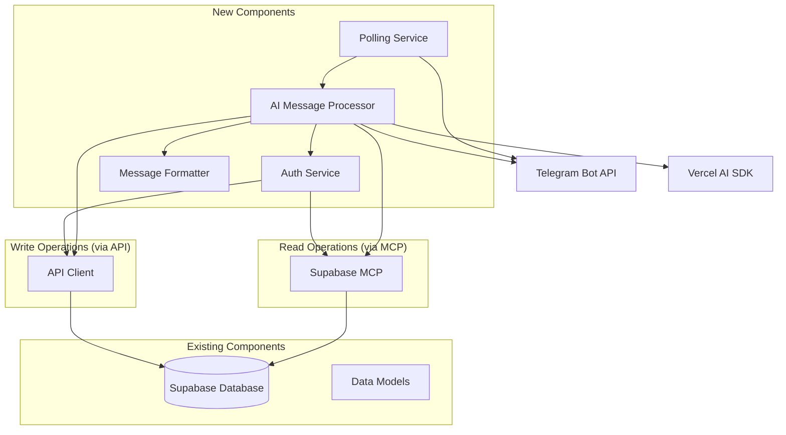

# Design Document

## Overview

The Telegram AI Assistant feature extends the Clair spending tracker with a conversational interface through Telegram. Users can manage transactions, view insights, and receive personalized financial advice through natural language interactions powered by Vercel AI SDK. The system integrates with the existing API architecture and maintains data consistency with the web application.

## Architecture

### High-Level Architecture



### Component Interaction Flow

1. **Polling Service → Telegram**: Continuously polls for new messages (secure outbound-only)
2. **Polling Service → AI Processor**: New messages routed to AI system
3. **AI Processor → Vercel AI SDK**: Natural language processing
4. **AI Processor → Auth Service**: User authentication check
5. **Read Operations**: AI Processor → Supabase MCP (leveraging RLS for secure data access)
6. **Write Operations**: AI Processor → API Client → Supabase (for transactions, subscriptions)
7. **AI Processor → Message Formatter**: Format response for Telegram
8. **Message Formatter → Telegram**: Send formatted response back to user

## Components and Interfaces

### 1. Telegram Connection Handler

**Purpose**: Manages secure connection to Telegram Bot API

For enhanced security, we'll implement a **polling-based approach** instead of webhooks:

```typescript
interface TelegramPollingHandler {
  startPolling(): Promise<void>;
  stopPolling(): Promise<void>;
  handleUpdate(update: TelegramUpdate): Promise<void>;
  getUpdates(offset?: number): Promise<TelegramUpdate[]>;
}

interface TelegramUpdate {
  update_id: number;
  message?: TelegramMessage;
  callback_query?: TelegramCallbackQuery;
}

interface TelegramMessage {
  message_id: number;
  from: TelegramUser;
  chat: TelegramChat;
  text?: string;
  date: number;
}
```

**Security Benefits of Polling vs Webhooks:**

1. **No Public Endpoint**: No need to expose a public webhook URL that could be attacked
2. **Outbound Only**: All connections are initiated from your server to Telegram
3. **No Signature Validation Complexity**: Eliminates webhook signature validation vulnerabilities
4. **Better Rate Control**: More granular control over request frequency and timing
5. **Easier Development**: No need for HTTPS certificates or public domain setup
6. **Network Security**: Works behind firewalls and private networks

### 2. AI Message Processor

**Purpose**: Core component that processes user messages using AI and coordinates responses

```typescript
interface AIMessageProcessor {
  processMessage(message: TelegramMessage): Promise<ProcessedMessage>;
  generateResponse(intent: MessageIntent, context: UserContext): Promise<string>;
}

interface ProcessedMessage {
  intent: MessageIntent;
  entities: ExtractedEntities;
  confidence: number;
  requiresAuth: boolean;
}

interface MessageIntent {
  type: 'ADD_TRANSACTION' | 'VIEW_TRANSACTIONS' | 'DASHBOARD' | 'INSIGHTS' | 
        'SUBSCRIPTIONS' | 'HELP' | 'AUTH' | 'UNKNOWN';
  action?: string;
  parameters?: Record<string, any>;
}

interface ExtractedEntities {
  amount?: number;
  category?: string;
  date?: string;
  note?: string;
  dateRange?: { start: string; end: string };
  currency?: string;
}
```

### 3. Authentication Service

**Purpose**: Manages user authentication and session linking between Telegram and Clair accounts

```typescript
interface TelegramAuthService {
  linkAccount(telegramId: string, authToken: string): Promise<LinkResult>;
  isUserLinked(telegramId: string): Promise<boolean>;
  getUserContext(telegramId: string): Promise<UserContext | null>;
  generateAuthLink(telegramId: string): Promise<string>;
  unlinkAccount(telegramId: string): Promise<void>;
}

interface UserContext {
  userId: string;
  telegramId: string;
  authToken: string;
  preferences: UserPreferences;
  linkedAt: string;
}

interface UserPreferences {
  notifications: boolean;
  language: 'en' | 'id';
  timezone: string;
  currency: string;
}

interface LinkResult {
  success: boolean;
  message: string;
  authUrl?: string;
}
```

### 4. Transaction AI Service

**Purpose**: Handles transaction-related AI operations

```typescript
interface TransactionAIService {
  parseTransactionFromText(text: string): Promise<ParsedTransaction>;
  formatTransactionList(transactions: Transaction[]): string;
  generateTransactionInsights(transactions: Transaction[]): Promise<string>;
}

interface ParsedTransaction {
  amount: number;
  category: string;
  note?: string;
  date: string;
  confidence: number;
  needsConfirmation: boolean;
}
```

### 5. Dashboard AI Service

**Purpose**: Processes dashboard data and generates insights

```typescript
interface DashboardAIService {
  formatDashboardSummary(summary: DashboardSummary): string;
  generateSpendingInsights(
    summary: DashboardSummary, 
    transactions: Transaction[]
  ): Promise<string>;
  generatePersonalizedAdvice(userContext: UserContext): Promise<string>;
}
```

### 6. Message Formatter

**Purpose**: Formats responses for Telegram's message constraints and formatting

```typescript
interface MessageFormatter {
  formatTransaction(transaction: Transaction): string;
  formatTransactionList(transactions: Transaction[]): string;
  formatDashboard(summary: DashboardSummary): string;
  formatSubscriptions(subscriptions: Subscription[]): string;
  formatError(error: Error): string;
  splitLongMessage(message: string): string[];
}
```

### 7. Notification Service

**Purpose**: Handles proactive notifications and alerts

```typescript
interface NotificationService {
  scheduleSpendingAlert(userId: string, threshold: number): Promise<void>;
  sendWeeklySummary(userId: string): Promise<void>;
  sendSubscriptionReminder(userId: string, subscription: Subscription): Promise<void>;
  cancelNotifications(userId: string): Promise<void>;
}
```

## Data Models

### New Models

```typescript
// Telegram user linking
interface TelegramUserLink {
  id: string;
  telegram_id: string;
  user_id: string;
  auth_token: string;
  preferences: UserPreferences;
  created_at: string;
  updated_at: string;
  last_activity: string;
}

// Conversation context for AI
interface ConversationContext {
  telegram_id: string;
  session_id: string;
  context: Record<string, any>;
  expires_at: string;
  created_at: string;
}

// Notification settings
interface NotificationSettings {
  user_id: string;
  telegram_id: string;
  spending_alerts: boolean;
  weekly_summary: boolean;
  subscription_reminders: boolean;
  alert_threshold?: number;
  preferred_time?: string;
  timezone: string;
}
```

### Extended Existing Models

The existing Transaction, Subscription, and Dashboard models will be reused without modification, maintaining consistency with the web application.

## Error Handling

### Error Categories

1. **Authentication Errors**
   - Unlinked account
   - Expired tokens
   - Invalid authentication

2. **AI Processing Errors**
   - Unclear user input
   - Parsing failures
   - Context loss

3. **API Errors**
   - Network failures
   - Rate limiting
   - Data validation errors

4. **Telegram API Errors**
   - Message too long
   - Bot blocked by user
   - Network issues

### Error Response Strategy

```typescript
interface ErrorHandler {
  handleAuthError(error: AuthError, telegramId: string): Promise<string>;
  handleAIError(error: AIError, context: ConversationContext): Promise<string>;
  handleAPIError(error: APIError): Promise<string>;
  handleTelegramError(error: TelegramError): Promise<void>;
}
```

## Testing Strategy

### Unit Testing

1. **AI Message Processing**
   - Test intent recognition accuracy
   - Test entity extraction
   - Test response generation

2. **Authentication Service**
   - Test account linking flow
   - Test token validation
   - Test session management

3. **Data Formatting**
   - Test message formatting
   - Test data serialization
   - Test error message formatting

### Integration Testing

1. **Telegram Bot Integration**
   - Test webhook handling
   - Test message sending
   - Test callback handling

2. **API Integration**
   - Test existing API compatibility
   - Test data consistency
   - Test error propagation

3. **AI Service Integration**
   - Test Vercel AI SDK integration
   - Test conversation flow
   - Test context management

### End-to-End Testing

1. **User Journey Testing**
   - Complete authentication flow
   - Transaction management flow
   - Dashboard viewing flow
   - Subscription management flow

2. **Error Scenario Testing**
   - Network failure handling
   - Invalid input handling
   - Authentication failure handling

## Security Considerations

### Authentication Security

1. **Token Management**
   - Secure token storage
   - Token expiration handling
   - Token refresh mechanism

2. **User Verification**
   - Telegram ID validation
   - Account linking verification
   - Session management

### Data Privacy

1. **Message Handling**
   - No persistent message storage
   - Secure context management
   - User data encryption

2. **AI Processing**
   - Local processing where possible
   - Minimal data sharing with AI services
   - User consent for AI features

### API Security

1. **Rate Limiting**
   - Per-user rate limits
   - Bot-wide rate limits
   - Graceful degradation

2. **Input Validation**
   - Message content validation
   - Parameter sanitization
   - SQL injection prevention

## Performance Considerations

### Response Time Optimization

1. **AI Processing**
   - Streaming responses for long operations
   - Caching common responses
   - Parallel processing where possible

2. **API Calls**
   - Connection pooling
   - Request batching
   - Caching strategies

### Scalability

1. **Webhook Handling**
   - Asynchronous processing
   - Queue-based architecture
   - Load balancing

2. **Database Operations**
   - Connection optimization
   - Query optimization
   - Caching layer

## Deployment Architecture

### Infrastructure Components

1. **Telegram Bot API**
   - Bot token management
   - Webhook configuration
   - Rate limit monitoring

2. **Application Server**
   - Next.js API routes
   - Vercel deployment
   - Environment configuration

3. **Database**
   - Existing database schema extension
   - Migration scripts
   - Backup strategies

### Environment Configuration

```typescript
interface TelegramBotConfig {
  TELEGRAM_BOT_TOKEN: string;
  TELEGRAM_WEBHOOK_SECRET: string;
  TELEGRAM_WEBHOOK_URL: string;
  VERCEL_AI_API_KEY: string;
  AI_MODEL: string;
  RATE_LIMIT_PER_USER: number;
  SESSION_TIMEOUT: number;
}
```

## Integration Points

### Dual Data Access Strategy

The Telegram bot uses a hybrid approach for data operations:

#### Read Operations via Supabase MCP
For data retrieval, the AI agent will use Supabase MCP tools to leverage existing Row Level Security (RLS) policies:

```typescript
// AI agent uses MCP tools for secure read operations
interface SupabaseMCPIntegration {
  // These will be available as MCP tools to the AI agent
  getUserTransactions(userId: string, limit?: number): Promise<Transaction[]>;
  getDashboardSummary(userId: string): Promise<DashboardSummary>;
  getSubscriptions(userId: string): Promise<Subscription[]>;
  getProjectedSubscriptions(userId: string, endDate?: string): Promise<ProjectedSubscription[]>;
}

// AI agent context with MCP access
class TelegramAIAgent {
  // AI agent will have access to MCP tools for reading data
  // RLS policies ensure users can only access their own data
  async getTransactionsForUser(telegramId: string) {
    const userContext = await this.getUserContext(telegramId);
    // MCP tool call - RLS automatically filters by user_id
    return await this.mcpTools.getUserTransactions(userContext.userId);
  }
}
```

#### Write Operations via API Client
For data modifications, the bot will use the existing API client to maintain consistency:

```typescript
// Reuse existing API client for write operations
import { apiClient } from '@/lib/apiClient';

class TelegramBotService {
  private apiClient = apiClient;
  
  async createTransaction(userId: string, transactionData: TransactionCreateData) {
    // Set user token for API authentication
    const userContext = await this.getUserContext(userId);
    this.apiClient.setToken(userContext.authToken);
    
    return this.apiClient.createTransaction(transactionData);
  }
  
  async createSubscription(userId: string, subscriptionData: SubscriptionCreateData) {
    const userContext = await this.getUserContext(userId);
    this.apiClient.setToken(userContext.authToken);
    
    return this.apiClient.createSubscription(subscriptionData);
  }
}
```

### MCP Configuration

The Supabase MCP server will need to be configured in the Kiro MCP settings:

```json
{
  "mcpServers": {
    "supabase": {
      "command": "uvx",
      "args": ["supabase-mcp-server@latest"],
      "env": {
        "SUPABASE_URL": "your-supabase-url",
        "SUPABASE_SERVICE_ROLE_KEY": "your-service-role-key",
        "FASTMCP_LOG_LEVEL": "ERROR"
      },
      "disabled": false,
      "autoApprove": [
        "supabase_select_transactions",
        "supabase_select_subscriptions", 
        "supabase_select_dashboard_summary"
      ]
    }
  }
}
```

### Data Model Consistency

All data operations will use existing TypeScript interfaces to ensure type safety and consistency between web and Telegram interfaces.

### Authentication Integration

The bot will integrate with the existing authentication system:

1. **For MCP Operations**: User context provides the user_id that RLS policies use for filtering
2. **For API Operations**: User's auth token is used with the existing API client
3. **Account Linking**: Secure OAuth-like flow validates existing Clair credentials

### Security Benefits

This dual approach provides several security advantages:

1. **RLS Protection**: Read operations automatically respect existing database security policies
2. **API Consistency**: Write operations use the same validation and business logic as the web app
3. **Token Management**: Separate token handling for different operation types
4. **Audit Trail**: All write operations go through the same logging and monitoring as web operations