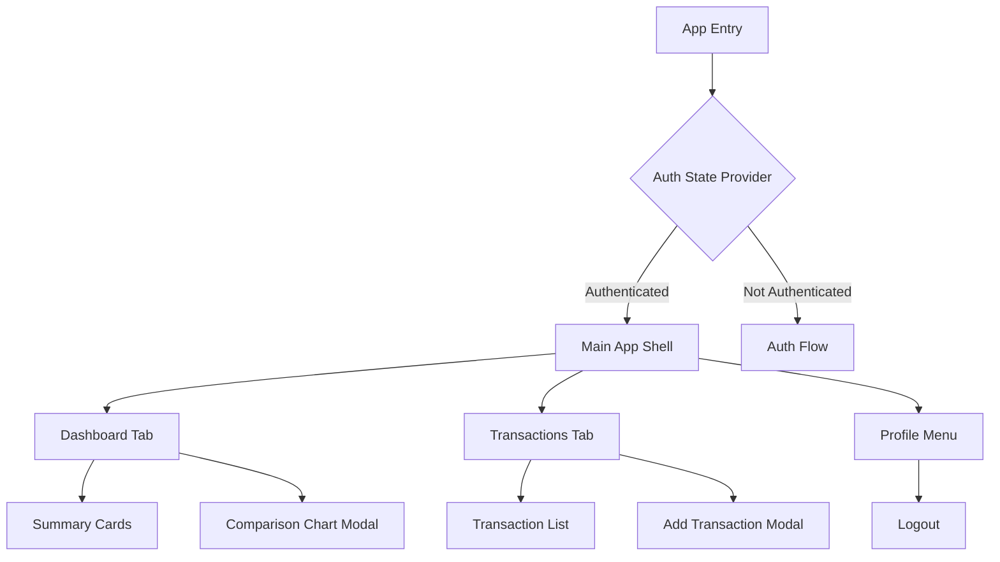
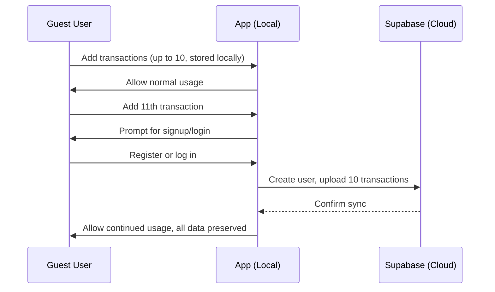

# RFC: Mobile App Implementation Plan (Flutter)

## Overview

This RFC proposes a detailed plan for implementing a mobile version of the Veeda Wallet app using Flutter. The app will initially use secure local storage (preferably Isar) for all data, but the architecture will be designed for seamless future integration with Supabase for authentication and cloud storage. The goal is to achieve feature parity with the current Next.js web app.

---

## 1. Recommended Flutter Packages

**Secure Local Storage**
- [`isar`](https://pub.dev/packages/isar): Fast, local, NoSQL storage for transactions and user data.
- [`flutter_secure_storage`](https://pub.dev/packages/flutter_secure_storage): For storing credentials and sensitive data.

**State Management**
- [`Riverpod`](https://pub.dev/packages/flutter_riverpod) (recommended for scalability and testability)
- Alternatives: [`Bloc`](https://pub.dev/packages/flutter_bloc), [`Provider`](https://pub.dev/packages/provider)

**Charts**
- [`fl_chart`](https://pub.dev/packages/fl_chart): Modern, flexible charts for summary modals.

**UI & Navigation**
- [`go_router`](https://pub.dev/packages/go_router) or [`auto_route`](https://pub.dev/packages/auto_route): For declarative routing and protected routes.
- [`modal_bottom_sheet`](https://pub.dev/packages/modal_bottom_sheet): For modals (add transaction, charts).

**Supabase (for future integration)**
- [`supabase_flutter`](https://pub.dev/packages/supabase_flutter): For authentication and cloud sync.

---

## 2. High-Level App Structure



### Directory Structure (suggested)
```
lib/
  main.dart
  app.dart
  core/
    di/                # Dependency injection setup
    storage/           # Local storage abstraction (Isar)
    supabase/          # Supabase integration (future)
    models/            # Data models (Transaction, User)
    utils/             # Formatting, icons, etc.
  features/
    auth/
      data/            # Auth repository (local, supabase)
      domain/
      presentation/    # Login, signup screens
    dashboard/
      data/
      domain/
      presentation/    # Dashboard, summary cards, chart modal
    transactions/
      data/
      domain/
      presentation/    # List, add/edit modal
    profile/
      presentation/    # Profile menu, logout
  shared/
    widgets/           # Custom UI components (cards, buttons, modals)
    theme/             # App theme, colors, typography
```

---

## 3. Key Components & Data Flow

### Authentication Flow
- **Local Auth**: Store credentials securely with `flutter_secure_storage`. On login/signup, save a session token or flag.
- **Auth Provider**: Expose auth state (logged in/out) via Riverpod/Bloc. On app start, check for valid credentials.
- **Protected Routes**: Use a router guard to restrict main app access to authenticated users.
- **Logout**: Clear credentials and session state.

### Dashboard Tab
- **Summary Cards**: Show "Spent Today", "Spent This Week", "Spent This Month" with comparison to previous periods. Tapping week/month opens a modal with a comparison chart.
- **Data Calculation**: Aggregate transaction data locally for summaries and charts.
- **Chart Modal**: Use `fl_chart` to display week-over-week or month-over-month comparisons.

### Transactions Tab
- **List**: Paginated, infinite scroll, sortable (by date/amount), searchable (by note).
- **Add Transaction**: Modal form for new transactions.
- **Transaction Model**: 
  ```dart
  class Transaction {
    final String id;
    final double amount;
    final String category;
    final String note;
    final DateTime date;
    final String? userId; // nullable for local, required for Supabase
  }
  ```
- **Categories**: Enum or constant list (Food, Transportation, Housing, etc.).

### Profile Menu
- **Logout**: Button in a modal or drawer.

### UI/UX
- **Bottom Navigation Bar**: For Dashboard and Transactions.
- **Custom Widgets**: Cards, buttons, modals, inputs, etc.
- **Responsive Design**: Use Flutter’s layout system for all screen sizes.

### Clean Architecture & Dependency Injection
- **Data Layer**: Abstract repositories for auth and transactions (local and Supabase implementations).
- **Domain Layer**: Business logic, use cases.
- **Presentation Layer**: UI, state management.
- **DI**: Use `get_it` or Riverpod’s provider system for dependency injection.

### State Management
- **Riverpod**: For user session, transaction list, dashboard summaries, and UI state.

---

## 4. Guest Mode & Transaction Limit Before Signup

### Guest Access Flow

- **Guest Mode**: Users can access and use the app without logging in for their first 10 transactions.
- **Transaction Tracking**: The app tracks the number of transactions created in guest mode (locally, using Isar).
- **Prompt for Signup/Login**: After 10 transactions, users are prompted to sign up or log in to continue using the app.
- **Seamless Data Migration**: Upon successful registration or login, the app automatically syncs the initial 10 transactions to the backend (Supabase) and updates the local storage to reflect the new authenticated state.
- **Data Continuity**: The user’s transaction history is preserved and available after authentication, ensuring a smooth transition.

#### Guest-to-User Migration Flow



---

## 5. Data Migration Plan (Local → Supabase)

- **Abstract Data Sources**: All data access goes through repositories (local or Supabase).
- **Migration Flow**:
  1. On enabling Supabase (user signs up/logs in), authenticate user and fetch remote data.
  2. Upload all local transactions (created in guest mode) to Supabase, associating them with the new user account.
  3. Mark local data as migrated or clear after sync.
  4. Switch repository implementation to Supabase.
- **Conflict Handling**: Use timestamps or IDs to avoid duplicates.

---

## 6. Feature Parity Checklist

| Feature                        | Flutter Plan                                      |
|---------------------------------|---------------------------------------------------|
| Guest mode (first 10 tx)        | Local storage, no auth required                   |
| Auth (Sign up/in/out)           | Prompt after 10 tx, seamless migration            |
| Protected main area             | Router guard, state provider                      |
| Dashboard summary cards         | Custom widgets, local aggregation                 |
| Comparison charts (modal)       | `fl_chart`, modal_bottom_sheet                    |
| Transactions list               | Paginated, sortable, searchable, infinite scroll  |
| Add transaction (modal)         | Modal form, validation                            |
| Transaction model               | Matches Next.js, with userId for future           |
| Responsive, modern UI           | Custom widgets, Flutter best practices            |
| Profile menu/logout             | Modal/drawer, session clear                       |
| Clean architecture              | Data/domain/presentation, DI                      |
| State management                | Riverpod (recommended)                            |
| Data migration                  | Repository swap, sync logic                       |

---

## 7. Example Data Flow Diagram

```mermaid
flowchart TD
    subgraph Presentation
      UI[UI Widgets] --> State[State Provider (Riverpod)]
    end
    subgraph Domain
      State --> UseCases[Use Cases]
    end
    subgraph Data
      UseCases --> Repo[Repository (abstract)]
      Repo -->|Local| LocalStore[Isar]
      Repo -->|Cloud| Supabase[Supabase API]
    end
```

---

## 8. Migration-Ready Architecture

- All business logic and data access go through abstracted repositories.
- Switching from local to Supabase is a matter of swapping the repository implementation and running a migration sync.
- UI and state management are agnostic to the data source.

---

## 9. Notes

- **Local storage**: Isar is preferred for its performance and developer experience.
- **Supabase integration**: All models and flows are designed to allow seamless migration to cloud storage and authentication.
- **Testing**: Each layer (data, domain, presentation) should be unit and integration tested.
- **Accessibility**: Follow Flutter accessibility best practices for all custom widgets and navigation.

---

## 10. Next Steps

- Review and approve this RFC.
- Begin implementation with the proposed architecture and packages.
- Document any deviations or improvements during development.