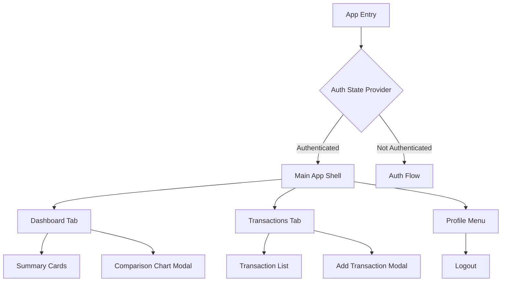

# Clair Wallet Mobile App (Flutter) – Step-by-Step Implementation Plan

## Phase 1: Project Foundation & Setup ✅ DONE

1. **Review and Update Project Metadata**
   - Update `pubspec.yaml` with app name, description, author, and versioning.
   - Set up app icons and splash screens for iOS/Android/web.

2. **Add Core Dependencies**
   - Add all recommended packages from the RFC:
     - `isar`, `flutter_secure_storage`, `flutter_riverpod`, `fl_chart`, `go_router` or `auto_route`, `modal_bottom_sheet`, `supabase_flutter` (for future), and any others as needed.
   - Run `flutter pub get` to install dependencies.

3. **Establish Directory Structure**
   - Refactor `lib/` to match the RFC’s suggested structure:
     ```
     lib/
       main.dart
       app.dart
       core/
         di/
         storage/
         supabase/
         models/
         utils/
       features/
         auth/
         dashboard/
         transactions/
         profile/
       shared/
         widgets/
         theme/
     ```
   - Create placeholder files for each major directory.
**Phase 1 completed on 2025-04-14**

---

## Phase 2: Core Architecture & State Management ✅ DONE

4. **Set Up Dependency Injection**
   - Implement DI using Riverpod’s provider system (or `get_it` if preferred).
   - Create a `core/di/` module for global providers.

5. **Define Data Models**
   - Implement `Transaction`, `User`, and any other required models in `core/models/`.
   - Ensure models are compatible with both Isar and Supabase.

6. **Abstract Data Sources**
   - Create repository interfaces for authentication and transactions in `core/`.
   - Implement local (Isar, secure storage) repositories first; stub Supabase repositories for future.

7. **Implement State Management**
   - Set up Riverpod providers for:
     - Auth state/session
     - Transaction list
     - Dashboard summaries
     - UI state (modals, navigation, etc.)

**Phase 2 completed on 2025-04-14**
---

## Phase 3: Authentication & Guest Mode (Local-Only, Remote Auth Deferred) ✅ DONE

> **Note:** Remote authentication (login, logout, Supabase integration, and guest-to-user migration) is deferred to a later phase. The current focus is on robust local authentication and device security.

8. **Implement Secure Local Authentication**
   - Use `local_auth` for biometric/device-level authentication (Face ID, Touch ID, fingerprint, device PIN).
   - Use `flutter_secure_storage` for storing credentials/session flags and encryption keys.
   - On app start, require successful local authentication before accessing any user data.
   - If authentication fails or is canceled, keep the app locked and show a secure lock screen.
   - Allow re-authentication on demand (e.g., after timeout, backgrounding, or sensitive actions).
   - Follow best practices for secure storage and privacy (see [Phase 3 Local Auth Plan](phase-3-local-auth-plan.md)).

9. **Guest Mode Logic (Deferred)**
   - Guest mode and transaction count tracking will be implemented after local authentication is complete.

10. **Auth Screens & Flow (Deferred)**
    - Login/signup screens and router guards for remote authentication will be implemented in a future phase.

**Phase 3 completed on 2025-04-14**
---

## Phase 4: Main App Shell & Navigation

12. **Set Up Routing**
    - Use `go_router` or `auto_route` for declarative navigation.
    - Implement protected routes for authenticated areas.

13. **App Shell & Navigation**
    - Create main app shell with bottom navigation bar (Dashboard, Transactions).
    - Add profile menu (modal or drawer).

---
**Phase 4 completed on 2025-04-14**
- Implemented app shell and navigation using go_router.
- Created placeholder screens for Dashboard, Transactions, and Profile.
- Integrated bottom navigation bar and profile menu placeholder.
- Updated main.dart to use the new app shell as the root widget.

## Phase 5: Feature Implementation

14. **Dashboard Tab**
    - Build summary cards: "Spent Today", "Spent This Week", "Spent This Month".
    - Implement local aggregation of transaction data.
    - On tap, open modal with comparison chart using `fl_chart`.

15. **Transactions Tab**
    - Implement paginated, infinite scroll transaction list.
    - Add sorting (by date/amount) and search (by note).
    - Build modal form for adding/editing transactions.
    - Use categories as enums/constants.

16. **Profile Menu**
    - Add logout button and any user settings.

17. **Custom Widgets & Theming**
    - Create reusable widgets (cards, buttons, modals, inputs) in `shared/widgets/`.
    - Set up app theme, colors, and typography in `shared/theme/`.

---

## Phase 6: Data Migration & Supabase Integration (Future-Proofing)

18. **Abstract Repository Switching**
    - Ensure all data access goes through repositories.
    - Prepare for easy swap from local to Supabase.

19. **Guest-to-User Migration**
    - On signup/login, sync guest transactions to Supabase.
    - Mark local data as migrated or clear after sync.

20. **Conflict Handling**
    - Use timestamps/IDs to avoid duplicate transactions during migration.

---

## Phase 7: Testing, Accessibility, and Polish

21. **Testing**
    - Write unit and integration tests for data, domain, and presentation layers.
    - Test guest mode, migration, and all major flows.

22. **Accessibility**
    - Ensure all custom widgets and navigation follow Flutter accessibility best practices.

23. **Responsive Design**
    - Test and optimize UI for various screen sizes and platforms.

24. **Documentation**
    - Document architecture, major flows, and any deviations from the RFC.

---

## Phase 8: Review & Launch

25. **Code Review & QA**
    - Conduct thorough code review and user testing.

26. **Prepare for Release**
    - Update README, changelog, and app store assets.
    - Build and test release versions for all platforms.

---

## Visual Overview

### High-Level App Structure (from RFC)


### Data Flow (from RFC)
```mermaid
flowchart TD
    subgraph Presentation
      UI[UI Widgets] --> State[State Provider (Riverpod)]
    end
    subgraph Domain
      State --> UseCases[Use Cases]
    end
    subgraph Data
      UseCases --> Repo[Repository (abstract)]
      Repo -->|Local| LocalStore[Isar]
      Repo -->|Cloud| Supabase[Supabase API]
    end
```

---

## Next Steps

- Review this plan with your team and update as needed before implementation.
- Begin development following the outlined phases and best practices.